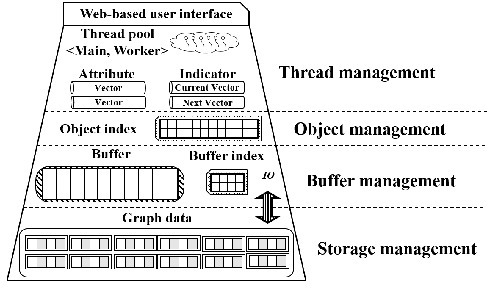

# graduation-project

## Motivation

In order to respond the growing demand to handle big graphs such as social networks, recent years have seen many proposals that offered the state-of-the-art graph engines aiming at efficient graph processing. Among many graph engines, we focus on the engines to process and analyze large-scale social networks efficiently on a single machine.

A social network is a typical example of real-world graphs following the power-law degree distribution which specifies that a few nodes have a lot of edges while a lot of nodes have a few edges. To the best of our knowledge, none of graph engines available now have been designed with this important characteristic of social networks in mind. Two technical issues need to be addressed for a graph engine to attain better performance with real-world graphs.

**Load balancing** : a graph algorithm is performed iteratively on a graph engine where nodes in each iteration could be processed only after all nodes in previous iteration is processed. To achieve higher performance, all nodes to be processed for each iteration need to be evenly distributed over a group of threads. Existing graph engines adopt a node-based workload distribution that each thread is assigned with each node and its edges (i.e., adjacent nodes). This makes a thread processing a node with high-degree a straggler due to the power-law degree distribution, which incurs a skewed distribution of the workload for threads. This indeed slows down the progress of graph processing. So, a uniform distribution of workloads across threads is important.

**Indicator scanning** : When performing any type of graph algorithms, graph engines generally use an indicator consisting of a big bit vector with bits corresponding to all nodes, to identify a group of nodes to be processed in each iteration (e.g., in the case of BFS, it is necessary to identify nodes to be visited in each iteration). These nodes are identified by linearly scanning the big indicator. When processing real-world graphs, a large majority of nodes with low degree are accessed in most iterations, while a few hub nodes with high degree are accessed in only a few iterations. This skewed degree distribution surely makes an indicator extremely sparse in most iterations, which causes linear scan for the sparse indicator to be extremely inefficient. Therefore, designing an efficient way of scanning the indicator is crucial.

## Proposed Graph Engine

We propose a graph engine that runs on a single machine and is intended to address two important issues in processing large-scale social networks. Our graph engine consists of four layers as fig:archi: a storage management layer, a buffer management layer, an object management layer, and a thread management layer. On top of them, we also provide a web-based user interface1.

    
    Figure 1: Architecture of our graph engine.

Figure 2: Performance comparison of graph engines.

In our graph engine, three layers except for the thread management layer use the design concepts adopted in existing storage systems such as WiSS for managing memory and storage space. The storage space is partitioned to blocks (e.g., pages) which are aligned with the I/O unit. A block contains a number of objects (e.g., records), each of which represents an adjacency list of a node (i.e., a node with its adjacent nodes). If an object cannot fit a given block, it could be stored across multiple blocks. We also store graphs by considering data locality for efficient access to the secondary storage following our method in. The thread management layer manages a pool of threads and accesses/processes graph data using thread pooling. In addition, we propose two techniques leveraging the power-law degree distribution to achieve high the performance as follows.

Block-based workload distribution: for a uniform distribution of workloads, we determine to use the block-based approach for the workload distribution where each thread processes a fixed-size block instead of a variable-size object. The block has multiple objects or a part of an object. However, the total size of objects in each block is almost identical regardless of each object size. This distribution policy could achieve the uniform distribution of workloads, which helps achieve great performance improvement.

**Hierarchical indicator** : To alleviate this overhead of indicator scanning, we use a hierarchical indicator. Its lowest-level indicator has the same bit vector as existing one. A higher-level indicator consists of a bit vector where each bit compresses a range of a lower-level indicator which is divided into fixed ranges. Here, a bit set in the higher-level indicator implies that a range of the lower-level indicator corresponding to the bit is necessary to be scanned. Otherwise, the range does not need to be scanned. A scan operation with this hierarchical indicator starts from the highest-level indicator (i.e., root) and moves down to a lower-level indicator only if a bit in the higher-level indicator is set. As a result, most of ranges in the sparse lowest-level indicator are skipped, which reduces unnecessary scanning of the indicator.

## Evaluation

We compared the performance and scalability of our graph engine (i.e., OurGE) with those of five state-of-the-art graph engines. TuboGraph, GridGraph, and GraphChi follow a vertex-centric programming model and an external memory model. Since FlashGraph adopts a semi-external-memory model, it is infeasible if a dataset cannot reside in memory. X-Stream adopts an edge-centric model and thus reads all graph data at every iteration. For evaluation, we used a PC equipped with i7-7700K, 64GiB memory, and 1TB SSD. We used six real-world datasets 2 in tab:ge-data. We conducted the experiments with three graph algorithms commonly provided by all graph engines such as BFS, PageRank, and WCC.

Table 1: Real-world social networks

| Datasets        | Wiki | UK   | Twit | SK  | Friend | Yahoo |
|-----------------|------|------|------|-----|--------|-------|
| num of nodes(M) | 12   | 39   | 61   | 50  | 68     | 1413  |
| num of edges(B) | 0.37 | 0.93 | 1.4  | 1.9 | 2.5    | 6.6   |
| Graph size(GiB) | 5.7  | 16   | 24   | 32  | 44     | 114   |

fig:performance shows the performance of graph engines for each algorithm. We measured the execution times in log-scale, changing the datasets. We observed that OurGE outperforms all other graph engines significantly. As the size of datasets gets larger, the execution times of all graph engines increase, and the performance gaps between OurGE and others are widening. In the case of GraphChi and X-Stream, BFS and WCC on the largest dataset (i.e., Yahoo dataset), are not completed within 24 hours (i.e., O.O.T). FlashGraph could not perform PageRank and WCC on the Yahoo dataset in limited memory (i.e., O.O.M). TurboGraph does not work on WCC of the Wikipedia dataset.

fig:performance-(a) shows the execution times of BFS. The performance of OurGE is much better than those of the fastest one with different models, FlashGraph, and the fastest one with same models, TurboGraph, by 6 and 43 times, respectively. fig:performance-(b) shows the execution times of PageRank. Since PageRank accesses all nodes at every iteration, graph engines do not use the indicator. Our graph engine, however, outperforms in all cases due to the nice load balancing by the block-based workload distribution. We see that OurGE is better than TurboGraph by 7 times, and its scalability is superior to that of FlashGraph. fig:performance-(c) shows the execution times of WCC. OurGE is also the best one in all cases except for the Twit dataset in terms of both performance and scalability. Through these experiments, we verified that our techniques are effective and help improve the performance and scalability of OurGE.
